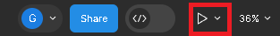

# Extra Informations

-Usar sites como Vector Images Free
-Se selecionar um 'objeto', como por exemplo, a forma do botão e o texto dentro dele, você pode arrastá-lo pra fora do layout e clicar em 'create components', tornando esse objeto reutilizável. (Lembrar de renomear o componente)
-Selecionar elementos de uma parte da página, como por exemplo o header, e dar Ctrl + G pra agrupá-los e nomear o grupo como header. E clicar no cadeado pra não ser possível alterá-los enquanto estamos mexendo no resto do design da página.
-Clicar em um elemento (ex: Vantagens do WorkUs) e clicar em prototype. Então clicar em Interactions e fazer por exemplo, o link entre o 'Vantagens do WorkUs' no header com a ação de scroll automática pra área de banner 2.

- O botão de 'present' mostra um preview de como a página está/ficará na web.
